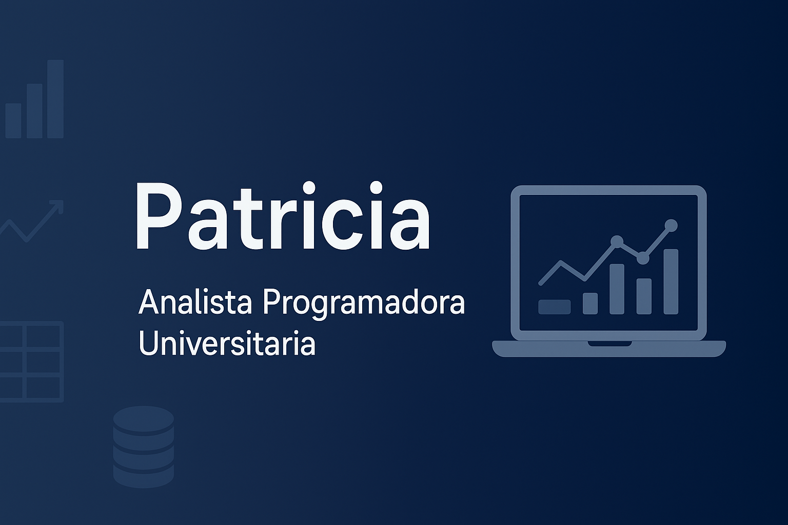

# ¡Bienvenido a mi GitHub! <picture><source srcset="https://fonts.gstatic.com/s/e/notoemoji/latest/1f44b/512.webp" type="image/webp"></picture>

Hola, soy **Patricia**. 

🎓 Analista Programador Universitario | Apasionada por convertir datos en decisiones inteligentes 📊

• • •

## 📈 Sobre mí

- Transformo datos complejos en insights claros.  
- Siempre explorando nuevas tecnologías y mejores prácticas.  

• • •

## 🧰 Herramientas y tecnologías

Resumen de mis habilidades y herramientas favoritas:

&nbsp;
&nbsp;
&nbsp;
&nbsp;
&nbsp;
  

• • •

## 🧩 Actualmente

- Explorando y perfeccionando herramientas de IA generativa  
- Automatizando procesos para optimizar tareas y flujos de trabajo

• • •

## 📊 Mis estadísticas en GitHub

  
  

• • •

    <strong>¡Gracias por visitar mi perfil! 😊</strong>

    

